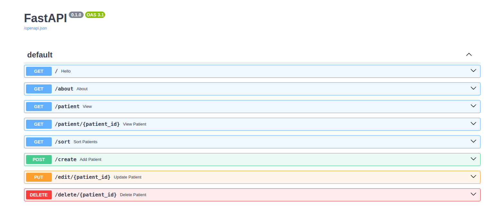

# 🏥 Patient Management System API

A **FastAPI** based REST API to manage patient records.  
It supports **CRUD** operations and sorting of patient data, using **Pydantic models** for validation and schema definition.

---

## 🚀 Features
- Create, Read, Update, Delete patient records.
- Sort patients by `height`, `weight`, or `bmi`.
- Auto-computation of **BMI** and a **verdict** (Underweight, Normal, Obese).
- Swagger UI (`/docs`) and ReDoc (`/redoc`) for API exploration.

---

## 🖼️ API Screenshot
Below is the FastAPI Swagger UI of the project:

---
